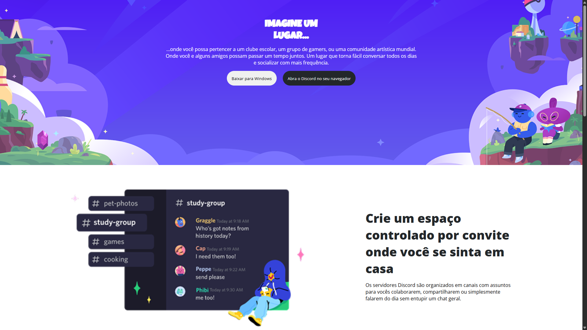
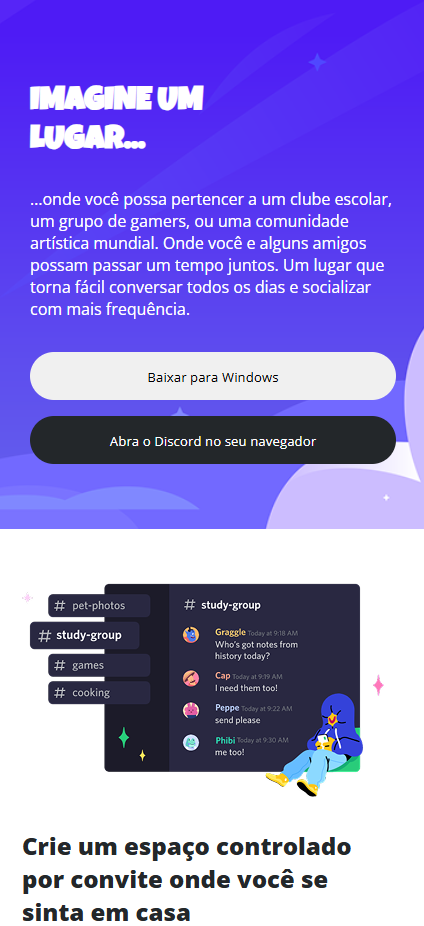

# PT-BR Discord UI Clone




## 💻 Tecnologias

Este projeto foi construído do zero utilizando as seguintes tecnologias:

- **HTML5**: Estrutura e marcação semântica.
- **CSS3**: Estilização, flexbox para alinhamento e técnicas de responsividade.

## ✨ Funcionalidades

- **Clone da Interface**: Reprodução fiel da interface do usuário (UI) do Discord.
- **Layout Responsivo**: O design se adapta perfeitamente a diferentes tamanhos de tela, de desktops a dispositivos móveis.
- **Estrutura semântica**: Utilização de tags HTML apropriadas para uma melhor acessibilidade e SEO.

## 🚀 Como Executar

Para ver este projeto em ação na sua máquina, siga os passos abaixo:

1. Clone o repositório:
   ```bash
   git clone [https://github.com/seu-usuario/discord-ui-clone.git](https://github.com/seu-usuario/discord-ui-clone.git)

# EN-US Discord UI Clone


## 💻 Technologies

This project was built from scratch using the following technologies:

- **HTML5**: Semantic structure and markup.
- **CSS3**: Styling, flexbox for alignment, and responsive design techniques.

## ✨ Features

- **UI Clone**: A faithful reproduction of the Discord user interface (UI).
- **Responsive Layout**: The design adapts perfectly to different screen sizes, from desktops to mobile devices.
- **Semantic Structure**: Use of appropriate HTML tags for better accessibility and SEO.

## 🚀 How to Run

To see this project in action on your machine, follow these steps:

1. Clone the repository:
   ```bash
   git clone [https://github.com/your-username/discord-ui-clone.git](https://github.com/your-username/discord-ui-clone.git)